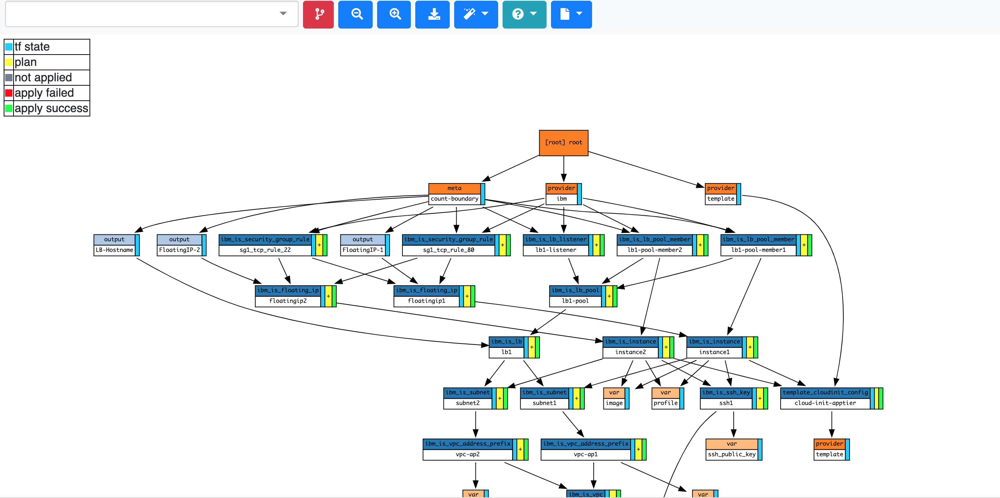
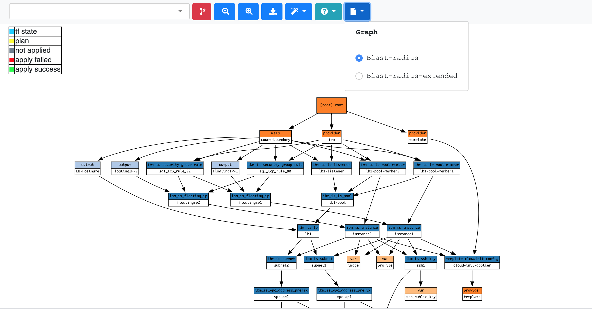
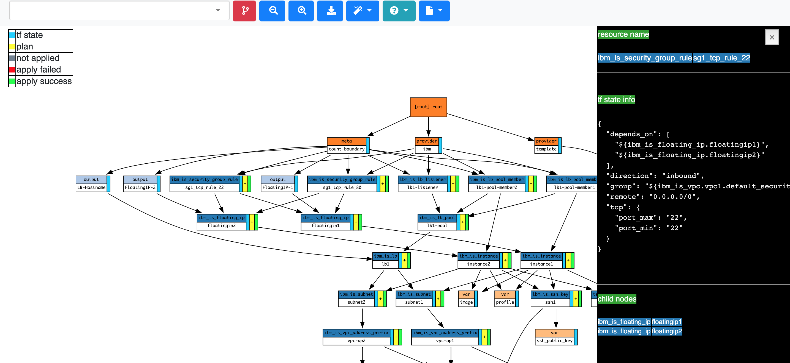

# Blast Radius


[](https://badge.fury.io/py/BlastRadius)

[terraform]: https://www.terraform.io/
[examples]: https://28mm.github.io/blast-radius-docs/

_Blast Radius_ is a tool for reasoning about [Terraform][] dependency graphs with interactive visualizations.  We now have a new version of blast-radius tool enrich in information of resources.

> __Note:__ This version of blast-radius supports only terraform version 12

Use _Blast Radius_ to:

* __Learn__ about *Terraform* or one of its providers through real [examples][]
* __Document__ your infrastructure
* __Reason__ about relationships between resources and evaluate changes to them
* __Interact__ with the diagrams below (and many others) [in the docs][examples]

## Blast Radius


## Prerequisites

* [Graphviz](https://www.graphviz.org/)
* [Python](https://www.python.org/) 3.7 or newer
* [Go](https://golang.org/) 1.12.16 or newer

> __Note:__ For macOS you can `brew install graphviz`

## Quickstart

For installing blast-radius follow the follwing steps

* Make sure you have all the prerequisites
* create wheel file of this repo or you can directly download the binary

```
python3 setup.py sdist bdist_wheel
```

* install the wheel file that got created inside dist folder 
```
easy_install dist/blastradius-0.1.25.0-py3-none-any.whl
```
or if you are using binary just do 

```
easy_install blastradius-0.1.25.0-py3-none-any.whl
```

After blast radius is installed just go to the *Terraform* directory.  You must have initiliazed and planned your terraform files and store the plan information into json files.  Follow these steps

```
terraform init
```

```
terraform plan --out tfplan.binary
```

```
terraform show -json tfplan.binary > tfplan.json
```

if you want to see apply information also run (this step is optional)

```
terraform apply 
```

Once installed just point *Blast Radius* at that *Terraform*
directory:

```sh
blast-radius --serve /path/to/terraform/directory
```

And go to the browser link http://127.0.0.1:5000/.

The diagram for Blast radius will look like the below one



you will see tooltips options 
* Blast-radius
* Blast-radius-extended

### Blast-radius

It is the existing blast-radius graph visualization which is the same that is in the above picture of blast-radius

### Blast-radius-extended 

This graph is enrich of more information about the resources inside the terraform files, these information includes tfstate, plan and apply information.  We have onclick action on each existing tables rows for tfstate, plan and apply .  It will open a side div and displays all the selected information in that.




## Embedded Figures

You may wish to embed figures produced with *Blast Radius* in other documents.
You will need the following:

1. An `svg` file and `json` document representing the graph and its layout.
2. `javascript` and `css` found in `.../blastradius/server/static`
3. A uniquely identified DOM element, where the `<svg>` should appear.

You can read more details in the [documentation](doc/embedded.md)

## Implementation Details

*Blast Radius* uses the [Graphviz][] package to layout graph diagrams,
[hcl2json](https://github.com/tmccombs/hcl2json) to parse [Terraform][] configuration,
and [d3.js](https://d3js.org/) to implement interactive features and animations.

## Docker

To launch *Blast Radius* for a local directory by manually running:

* create a dockerhub account
```sh
docker build -t <dockerhub_username>/blast-radius:v1 .
```

```sh
docker push <dockerhub_username>/blast-radius:v1

```

```sh
docker run --cap-add=SYS_ADMIN -dit -p 5000:5000 -v <pathofdirectory>:/data:ro <dockerhub_username>/blast-radius:v1
```

### Docker configurations

*Terraform* module links are saved as _absolute_ paths in relative to the
project root (note `.terraform/modules/<uuid>`). Given these paths will vary
betwen Docker and the host, we mount the volume as read-only, assuring we don't
ever interfere with your real environment.

However, in order for *Blast Radius* to actually work with *Terraform*, it needs
to be initialized as well as planned compulsory. To accomplish this, the container creates an [overlayfs][]
that exists within the container, overlaying your own, so that it can operate
independently. To do this, certain runtime privileges are required --
specifically `--cap-add=SYS_ADMIN`.


#### Docker & Subdirectories

If you organized your *Terraform* project using stacks and modules,
*Blast Radius* must be called from the project root and reference them as
subdirectories -- don't forget to prefix `--serve`!

For example, let's create a Terraform `project` with the following:

```txt
$ tree -d
`-- project/
    |-- modules/
    |   |-- foo
    |   |-- bar
    |   `-- dead
    `-- stacks/
        `-- beef/
             `-- .terraform
```

It consists of 3 modules `foo`, `bar` and `dead`, followed by one `beef` stack.
To apply *Blast Radius* to the `beef` stack, you would want to run the container
with the following:

```sh
$ cd project
$ docker run --cap-add=SYS_ADMIN -dit  -p 5000:5000 -v <pathofdirectory>:/data:ro <dockerhub_username>/blast-radius:v1
```


## Further Reading

The development of *Blast Radius* is documented in a series of
[blog](https://28mm.github.io) posts:

* [part 1](https://28mm.github.io/notes/d3-terraform-graphs): motivations, d3 force-directed layouts vs. vanilla graphviz.
* [part 2](https://28mm.github.io/notes/d3-terraform-graphs-2): d3-enhanced graphviz layouts, meaningful coloration, animations.
* [part 3](https://28mm.github.io/notes/terraform-graphs-3): limiting horizontal sprawl, supporting modules.
* [part 4](https://28mm.github.io/notes/d3-terraform-graphs-4): search, pan/zoom, prune-to-selection, docker.

A catalog of example *Terraform* configurations, and their dependency graphs
can be found [here](https://28mm.github.io/blast-radius-docs/).

* [AWS two-tier architecture](https://28mm.github.io/blast-radius-docs/examples/terraform-provider-aws/two-tier/)
* [AWS networking (featuring modules)](https://28mm.github.io/blast-radius-docs/examples/terraform-provider-aws/networking/)
* [Google two-tier architecture](https://28mm.github.io/blast-radius-docs/examples/terraform-provider-google/two-tier/)
* [Azure load-balancing with 2 vms](https://28mm.github.io/blast-radius-docs/examples/terraform-provider-azurem/2-vms-loadbalancer-lbrules/)

These examples are drawn primarily from the `examples/` directory distributed
with various *Terraform* providers, and aren't necessarily ideal. Additional
examples, particularly demonstrations of best-practices, or of multi-cloud
configurations strongly desired.


